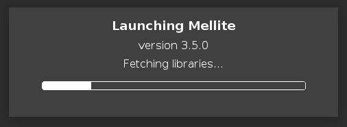
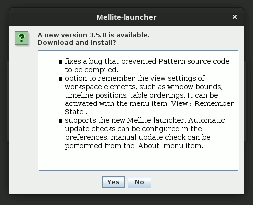
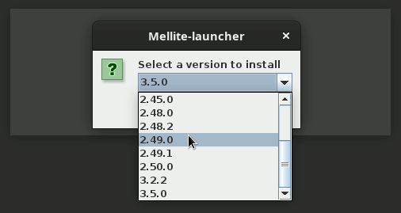

# Mellite-launcher

## statement

Mellite-launcher is a small JDK-bundled launcher stub for
[Mellite](https://github.com/Sciss/Mellite) that can download and update the actual application from
Maven Central artifacts retrieved by Coursier. When it is run the first time or when a scheduled update check
happens, the launcher checks online for the latest Mellite version and installs it (or prompts the user to confirm
update if already running a full version).

In the future, it will be the preferred way to install and update
Mellite. The idea is to avoid having to upload hundreds and hundreds
of megabytes of new application artifacts for small updates, and to avoid having to build platform specific
artifacts over and over again. The expectation is that the launcher needs to be updated very seldom, this one should 
be able to install the launcher once, and all subsequent  updates go through the launcher itself. Releasing new 
Mellite versions becomes as simple as publishing new Maven artifacts.

The project is (C)opyright 2020–2021 by Hanns Holger Rutz. All rights reserved.
It is released under 
the [GNU Lesser General Public License](https://git.iem.at/sciss/Mellite-launcher/raw/main/LICENSE) v2.1+ 
and comes with absolutely no warranties. To contact the author, send an e-mail to `contact at sciss.de`.

## requirements / installation

This project builds with sbt against Scala 2.13 (JVM). It needs Java 9 or newer to compile and run.

The following command line options are available:

| switch | description |
| ------ | ----------- |
|`--verbose`, `-V` |print verbose information during update.|
|`--offline`       |do not check online for updates.|
|`--check-update`  |force update check.|
|`--select-version`|force version selection (up- or downgrade).|
|`--headless`, `-h`|headless mode (no GUI windows). Passed on to the application.|
|`--prefix <name>` |installation prefix (default: 'coursier'). Allows to install multiple versions.|
|`--list`          |list installed prefixes and quit.|
|`--remove`        |remove the installation data for given prefix, and quit.|
|`--app-help`      |pass `--help` to the Mellite application.
|`--help`          |print this information. Use `--app-help` for Mellite application help.

Thus, once a full Mellite application version is installed, you can
use `--offline` to completely skip automatic update checks. The update
check period can be adjusted in the Mellite application preferences.
You can force an unscheduled check using `--check-update`. Normally, the
checks are only performed for versions of Mellite newer than the currently
installed one.

You can override this behaviour with `--select-version`,
which allows you to up- or downgrade to any published version of Mellite,
which can be useful if there is a newly introduced bug, or you need to open
a legacy workspace.

Unless `--offline` is selected, using the launcher also allows Mellite to be restarted
from its preferences dialog when making changes that require restart, such as changing
the look-and-feel.

## uninstall

In general, updating the Mellite version will remove the previous version. The easiest approach is
to list the installed prefixes via `--list`, then to remove an installation via
`--prefix <name> --remove`.

You can also wipe all date
by deleting the [application data directory](https://github.com/harawata/appdirs). The location depends on
the operating system:

- Linux: `/home/name/.local/share/mellite/`
- Windows: `C:\Users\name\AppData\Local\de.sciss\mellite\`
- macOS: `/Users/name/Library/Application Support/mellite/`

The cached meta-data (small) of available versions is stored in:

- Linux: `/home/mellite/.cache/mellite/`
- Windows: `C:\Users\name\AppData\Local\de.sciss\mellite\Cache\`
- macOS: `/Users/name/Library/Caches/mellite/`

The launcher configuration (small) is stored in

- Linux: `/home/name/.config/mellite`
- Windows: `C:\Users\name\AppData\Local\de.sciss\mellite\`
- macOS: `/Users/name/Library/Application Support/mellite/`

## notes

It's difficult to keep the classpath of the launcher and application itself separate; for example, once
AWT is initialised, it cannot be "uninitialised", and thus adding a look-and-feel jar to classpath has no
effect on the `UIManager` finding the new jar. Therefore, we spawn an entirely new process for the application,
then close the splash screen and join the child process until its termination.

-----

## creating new releases of the launcher itself

This section is an aide-mémoire for me in releasing stable versions.

- check that no `SNAPSHOT` versions of libraries are used: `cat build.sbt | grep SNAPSHOT`.
   Change `projectVersion` appropriately.
- check that libraries are up-to-date, and that there are no binary conflicts:
   `sbt dependencyUpdates evicted`
- Make sure the XFree desktop file version is set:
   `vim app/src/debian/Mellite-launcher.desktop`
- Update the release versions in `README.md`
- Test the app building: `sbt app/clean app/update app/test`
- Build the native image:
    `sbt -java-home '/home/hhrutz/Downloads/OpenJDK11U-jdk_x64_linux_hotspot_11.0.9_11/jdk-11.0.9+11' full/universal:packageBin full/debian:packageBin`
  
